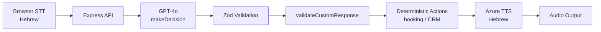

# Kol Voice Agent - Hebrew AI Sales Demo

A **Hebrew-speaking AI voice agent** that makes outbound sales calls and books meetings.

## What It Does

- **Speaks Hebrew** - Natural conversations using GPT-4o + Azure/Browser TTS
- **Outbound Sales Calls** - Greets leads, pitches value, handles objections
- **Books Meetings** - Offers available slots and confirms appointments
- **CRM Integration** - Logs activities and updates lead status

---

## Quick Start

### Prerequisites

- Node.js 18+
- Chrome browser (for speech recognition)
- OpenAI API key

### Setup

```bash
# Install dependencies
npm install

# Create .env file in project root
cat > .env << EOF
OPENAI_API_KEY=sk-your-key-here

# Optional: Azure Speech for better voice quality
# AZURE_SPEECH_KEY=your-azure-key
# AZURE_SPEECH_REGION=westeurope
EOF

# Seed demo data (leads, calendar slots)
npm run seed

# Start development servers
npm run dev
```

### Use the Demo

1. Open **http://localhost:5173** in Chrome
2. Select a lead from the list
3. Adjust the tone slider (formal - friendly)
4. Click **Start Call**
5. Click **Talk** to speak Hebrew to the agent
6. Watch the conversation in the transcript
7. Check the calendar when meetings are booked

---

## Architecture



### Project Structure

```
kol-voice-agent/
├── apps/
│   ├── web/                 # React + Vite frontend
│   │   └── src/app/
│   │       ├── routes/      # Home, CallConsole, Metrics
│   │       ├── components/  # LeadCard, Transcript, etc.
│   │       └── hooks/       # useWebSpeech, useCallSession
│   │
│   └── server/              # Express backend
│       └── src/
│           ├── domain/agent/  # AI conversation logic
│           ├── db/            # JSON persistence
│           ├── providers/     # OpenAI, Azure TTS
│           └── routes/        # REST API
│
└── packages/
    └── shared/              # Types + Zod schemas
```

### AI Decision Flow

1. Customer speaks Hebrew → Browser STT captures text
2. Text sent to server → `processUtterance()` called
3. GPT-4o `makeDecision()` returns structured JSON with:
   - `customResponse`: Hebrew text to speak
   - `nextState`: Where to go in conversation
   - `shouldBookMeeting`: Whether to book
   - `callOutcome`: MEETING_BOOKED, CALLBACK_REQUESTED, etc.
4. `validateCustomResponse()` checks Hebrew grammar/tone
5. Deterministic actions execute (slot booking, CRM logging)
6. Azure TTS speaks the response

### Conversation States

```
GREETING → PITCH → QUALIFY → MEETING_PROPOSAL → BOOKING → ENDED
```

---

## Testing

### Run Tests

```bash
npm test
```

### Manual Verification Checklist

- [ ] Browser STT captures Hebrew speech correctly
- [ ] Azure TTS speaks Hebrew responses clearly
- [ ] Meeting booked flow: slot marked booked, lead status updated
- [ ] Callback flow: CRM activity logged with CALLBACK_REQUESTED
- [ ] Not interested flow: CRM activity logged, polite goodbye

### What Is Tested (32 tests)

- Schema validation (AIDecisionSchema, LeadSchema, CallOutcomeSchema)
- Deterministic booking logic (slot booking, lead status updates)
- CRM activity creation (meeting booked, callback, not interested outcomes)

### What Is NOT Tested (By Design)

- Exact wording of AI responses (dynamic and non-deterministic)
- Live AI behavioral patterns (evaluated manually, not as blocking tests)
- STT/TTS audio quality (browser/device dependent)
- Real telephony integration (browser simulation only)
- Scale/concurrency (demo-grade)

---

## API Endpoints

| Endpoint | Method | Description |
|----------|--------|-------------|
| `/health` | GET | Status + feature flags |
| `/api/leads` | GET | List all leads |
| `/api/slots` | GET | Calendar slots |
| `/api/call/start` | POST | Start call session |
| `/api/call/utterance` | POST | Send customer message |
| `/api/call/end` | POST | End call |
| `/api/speech/tts` | POST | Azure TTS (if enabled) |

---

## Configuration

### Environment Variables

| Variable | Required | Description |
|----------|----------|-------------|
| `OPENAI_API_KEY` | Yes | GPT-4o for conversations |
| `AZURE_SPEECH_KEY` | No | HD voice quality |
| `AZURE_SPEECH_REGION` | No | Default: westeurope |

### Tone Setting

The tone slider (0-100) affects how the AI speaks:

- **0-30**: Formal Hebrew (business meeting style)
- **30-70**: Balanced (normal phone conversation)
- **70-100**: Friendly (warm, casual)

---

## Demo Data

The seed script creates:

- **7 leads** with Hebrew names and Israeli companies
- **98 calendar slots** across 2 weeks (9:00-17:00)
- **2 pre-booked meetings** to show calendar functionality
- **1 playbook** with Hebrew conversation templates

---

## Key Files

| File | Purpose |
|------|---------|
| `apps/server/src/domain/agent/aiDecider.ts` | AI prompt + decision logic |
| `apps/server/src/domain/agent/agentService.ts` | Call session management |
| `apps/web/src/app/hooks/useWebSpeech.ts` | Speech recognition + synthesis |
| `apps/web/src/app/hooks/useCallSession.ts` | Frontend call state |

---

## Limitations

- Sessions stored in-memory (lost on server restart)
- JSON file storage (not production-grade)
- Hebrew STT accuracy varies by speaker/accent
- No concurrent session handling

